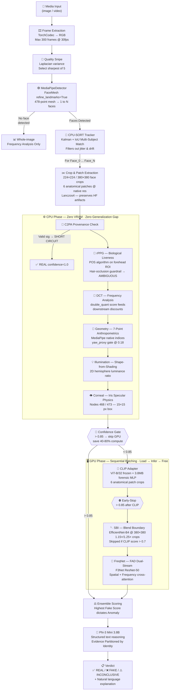

# 🛡️ Aegis-X: Agentic Multi-Modal Forensic Engine

> An autonomous deepfake detection system where a locally-running LLM brain orchestrates 8 orthogonal forensic tools — 5 physics-based (CPU), 3 transformer-based (GPU) — and explains its verdict in natural language grounded in specific tool evidence.

---

## Core Thesis: Signal Orthogonality

General-purpose CNNs overfit to the generator they were trained on. Aegis-X replaces generator-specific fingerprint detection with **physics laws, frequency mathematics, and generator-agnostic transformer architectures** — signals that do not change when a new generator is released. Each tool covers the blind spots of every other:

- **CPU tools** (physics + math) have no training data and no generalization gap — they catch violations that neural networks structurally cannot learn
- **GPU tools** (transformers) are trained on generator-agnostic objectives (blend boundaries, frequency inconsistencies, universal visual features) — they generalize across unseen generators
- **LLM brain** reasons over structured text outputs from all tools — it never sees raw pixel data

---

## System Architecture — End-to-End Flow



**Unified Preprocessing Philosophy:** A single `MediaPipeDetector` running `FaceMesh(refine_landmarks=True)` provides a clean failure path. MediaPipe returns a dense 478-point mesh in a single inference pass, so either *all* landmark-dependent tools run, or the agent correctly routes to the `landmarks is None` fallback. This perfectly maintains the **"Zero VRAM, Zero Generalization Gap"** philosophy: the CPU physics phase uses zero GPU memory and zero trained detector weights.

The agent does NOT run a fixed pipeline. It dynamically decides which tool to run, when to stop early (confidence > 0.85 after CPU phase skips all GPU tools), and when to skip tools (CLIP score > 0.7 means fully synthetic → skip SBI because SBI only detects face-swap blend boundaries).

---

## 1. Preprocessing Pipeline

The preprocessing stage converts raw media into the exact tensor contracts every downstream tool expects. Every downstream tool receives its input from the same preprocessing result — there is no per-tool preprocessing.

### 1.1 Frame Extraction (`utils/video.py`)

| Property | Detail |
|:---------|:-------|
| **Primary backend** | TorchCodec (official PyTorch Foundation, v0.8.1+) — uses NVIDIA NVDEC GPU decoding if available, silently falls back to CPU decoding |
| **Fallback backend** | `cv2.VideoCapture` — if TorchCodec is not installed at all (caught via `ImportError`) |
| **Output contract** | `list[np.ndarray]`, each `(H, W, 3)` uint8 **RGB** (not BGR) — regardless of backend |
| **Sampling** | Max 300 frames at 30fps target. `skip = max(1, round(native_fps / target_fps))` |
| **Color contract** | TorchCodec outputs RGB natively. cv2 outputs BGR → converted via `cv2.COLOR_BGR2RGB` before return. All downstream code uses `COLOR_RGB2GRAY`, never `COLOR_BGR2GRAY` |

### 1.2 Face Detection — MediaPipeDetector

Aegis-X relies heavily on precise 478-point facial landmarks. We use a **single unified detector** powered by MediaPipe Face Mesh with iris refinement enabled.

```python
class MediaPipeDetector:
    def __init__(self):
        self.face_mesh = mp.solutions.face_mesh.FaceMesh(
            static_image_mode=True,     # Each call treated as independent image
            max_num_faces=config.preprocessing.max_subjects_to_analyze,  # Configurable up to N faces
            refine_landmarks=True,      # CRITICAL: enables iris + attention mesh
                                        # Adds nodes 468–477 (10 iris/pupil points)
                                        # Without this, nodes 468–477 are absent
                                        # → corneal and IPD tools silently fail
            min_detection_confidence=0.5,
            min_tracking_confidence=0.5,
        )

    def detect(self, img: np.ndarray) -> tuple:
        """
        Args:
            img: (H, W, 3) uint8 RGB — must be RGB, not BGR
        Returns:
            (list[NormalizedLandmarkList] | None, source_str)
        """
        results = self.face_mesh.process(img)  # expects RGB
        if not results.multi_face_landmarks:
            return None, "none"
        return results.multi_face_landmarks, "mediapipe"
```

**Why `refine_landmarks=True` is non-negotiable:**
The standard Face Mesh (without refinement) produces only 468 landmark nodes covering the facial silhouette, eyes, nose, and mouth. `refine_landmarks=True` adds 10 additional nodes (468–477) that represent the **contours of both irises and pupils** using an iris-specific sub-model. Without this flag:
- Node `468` (Left Iris center) and node `473` (Right Iris center) **do not exist**
- `run_geometry()` IPD check silently reads garbage coordinates
- `run_corneal()` iris specular extraction silently fails

**Landmark coordinate contract:**
```python
# After detection, converting to pixel-space (478, 2) array:
h, w = img.shape[:2]
landmarks = np.array(
    [(lm.x * w, lm.y * h) for lm in face_landmarks.landmark],
    dtype=np.float32
)  # shape: (478, 2), columns: (pixel_x, pixel_y)
   # Indices 0–467: standard Face Mesh nodes
   # Indices 468–472: Left iris (center + 4 contour points)
   # Indices 473–477: Right iris (center + 4 contour points)
```

**Robust Face Detection:** MediaPipe handles difficult angles and occlusions robustly in a single pass, and when it does fail, the agent correctly routes to the `landmarks is None` fallback path — GPU tools still run, the agent still produces a verdict. This perfectly maintains the **"Zero VRAM, Zero Generalization Gap"** philosophy for the CPU phase.

### 1.2.1 Multi-Subject Temporal Tracking (CPU-SORT)

**The "Foreground Decoy" Vulnerability:** A naive preprocessing pipeline evaluates only the largest face in a frame. This creates a severe blind spot in "in-the-wild" datasets (e.g., WildDeepfake) or real-world investigations: if a real subject stands in the foreground while a deepfaked subject stands in the background, the system evaluates the authentic pixels, scores it as `✅ REAL`, and misses the manipulation entirely. 

To mitigate this without violating the CPU phase's "Zero VRAM" philosophy, Aegis-X upgrades from a stateless single-face heuristic to a **stateful multi-subject temporal tracker**, driven entirely by CPU mathematics.

**Algorithm: MediaPipe + CPU-SORT (ByteTrack-style IoU)**
Instead of relying on heavy Re-ID CNNs (like DeepSORT) which require ~300MB of GPU VRAM, we pair MediaPipe's raw coordinate output with a native Python implementation of the SORT tracking algorithm. 
1. **Detection:** MediaPipe extracts all bounding boxes in the frame.
2. **Prediction:** A Kalman Filter predicts the spatial state vector $[u, v, s, r, \dot{u}, \dot{v}, \dot{s}, \dot{r}]^T$ for each known track.
3. **Association:** The Hungarian algorithm solves the bipartite matching problem between predicted tracks and new detections using pure Intersection-over-Union (IoU) costs.

| Property | Value |
|:---------|:------|
| **VRAM Cost** | **0 MB** (preserves the GPU phase isolation) |
| **Compute Cost** | ~1-2ms per frame (native CPU matrix operations) |
| **Temporal Stability** | Eliminates spatial drift during the 1.6s `run_rppg()` window, ensuring the POS algorithm samples the exact same anatomical region even if subjects cross paths. |

**Resource Bounding: The `max_subjects_to_analyze` Gate**
Tracking multiple faces introduces an $O(N)$ time complexity multiplier to the pipeline. Analyzing 10 tiny faces in a crowd wastes compute on subjects lacking the pixel density required for valid physical signal extraction (e.g., corneal specular highlights or rPPG temporal frequencies). 

We enforce a strict upper bound via `config.yaml`:
```yaml
preprocessing:
  max_subjects_to_analyze: 2  # Evaluates the 2 largest tracked identities
  min_face_resolution: 64     # Skips tracks where bounding box < 64x64 pixels
```

**Execution Flow Contract Updates:**

*   **CPU Phase:** Runs independently for each tracked identity (Face_0, Face_1). If Face_0 is 0.10 and Face_1 is 0.92, the highest fake score dictates the anomaly flag.
*   **GPU Phase (Sequential Batching):** To maintain the strict 4GB VRAM ceiling, GPU tools do not reload per face. The agent loads the model once, batches Face_0 and Face_1 sequentially, and then executes the non-negotiable `finally: torch.cuda.empty_cache()` block.
*   **LLM Synthesis:** The Phi-3 prompt injection now receives a structured dictionary of evidence partitioned by identity (e.g., "Subject 0 (Foreground): ... Subject 1 (Background): ..."), allowing the LLM to output precise, multi-actor forensic verdicts.


### 1.3 Quality Snipe — Sharpest Frame Selection

**Problem:** Frame 0 is typically an I-frame — the most heavily compressed. Motion blur and blinking at Frame 0 hide deepfake artifacts, causing false negatives.

**Solution:** Evaluate Laplacian variance (`cv2.Laplacian(gray_crop, cv2.CV_64F).var()`) across 5 evenly-spaced frames using `np.linspace(0, len(frames)-1, num=5, dtype=int)`. Select the sharpest one.

| Property | Value |
|:---------|:------|
| MediaPipe calls | **ZERO additional** — reuses `face_rect` from initial detection as a static cookie-cutter |
| Time cost | <1ms total |
| VRAM cost | Zero |

> ⚠️ **CRITICAL:** Landmarks MUST be re-extracted on the winning frame. The face position shifts between frames (head tilt, slight movement). Reusing Frame 0's landmarks with the winning frame's pixels causes all landmark-based crops to be spatially misaligned with the actual face. No error is thrown — the crops silently contain wrong pixels.

### 1.4 Crop & Patch Extraction

All crops are built from the winning frame at **native resolution first**, then resized:

1.  **`extract_native_crop()`** — Crop at native resolution → expand bbox by margin → resize ONLY the cropped region using `cv2.INTER_LANCZOS4` (sinc kernel, 8×8 pixel neighborhood — preserves 1–8px high-frequency GAN/diffusion artifacts much better than bilinear averaging)
2.  **224×224 face crop** — for DCT, CLIP, FreqNet (standard input size for many vision models)
3.  **380×380 face crop** — for SBI (EfficientNet-B4 compound scaling, requires higher resolution)
4.  **6 anatomical patches** — for CLIP adapter (each 224×224 at native res, targeting specific facial regions)
5.  **All frames** pass through as `frames_30fps` for rPPG temporal signal

**Do NOT** downscale the full frame before cropping, apply JPEG compression before cropping, or use bilinear/nearest interpolation. All three destroy the Layer 3 high-frequency signal.

### 1.5 `PreprocessResult` Output

```python
PreprocessResult(
    has_face=True,
    tracked_faces=[
        TrackedFace(
            identity_id=0,
            landmarks=landmarks_0,           # (478, 2) from winning frame
            trajectory_bboxes=...,           # dict: frame_idx -> [x1, y1, x2, y2]
            face_crop_224=face_crop_224_0,   # 224×224 for DCT, CLIP, FreqNet
            face_crop_380=face_crop_380_0,   # 380×380 for SBI
            patch_left_eye=...,              # 6 native-res patches for CLIP adapter
            patch_right_eye=...,
            patch_hairline=...,
            patch_jaw=...,
        ),
        # ... up to max_subjects_to_analyze
    ],
    frames_30fps=frames,           # ALL frames for rPPG temporal signal
    selected_frame_index=best_idx, # Diagnostic only — no downstream tool reads this
    original_media_type="video",
)
```

---

## 2. CPU Tools — Zero VRAM, Zero Training Data, Zero Generalization Gap

These tools are based on **physics and mathematics**. They have no model weights, no training data, and therefore no generalization gap. They work against any generator — past, present, or future.

---

### 2.1 `check_c2pa()` — Content Provenance Gate

**Input:** Raw file path
**Output:** `{valid: bool, signer: str, timestamp: str}`

Verifies C2PA (Coalition for Content Provenance and Authenticity) cryptographic signatures embedded by supported cameras (Leica, Sony, Nikon with CAI) or editing software (Adobe Photoshop, Lightroom).

**Critical behavior:**
- If `valid=True` → **short-circuit the entire pipeline**. `core/agent.py` intercepts immediately, bypasses the LLM entirely (saves ~3s, structurally eliminates hallucination risk over cryptographic certainty). Returns REAL with confidence=1.0.
- If unsigned (99% of files) → contributes `(0.0, 0.0)` to ensemble — zero contribution, zero weight pull. Does not vote REAL or FAKE.

**Safety enforcement in `forensic_summary.py`:**
```python
if ensemble_result.c2pa_verified:
    raise ValueError(
        "C2PA verified cases must not reach forensic_summary. "
        "core/agent.py must intercept before calling this function."
    )
```

---

### 2.2 `run_rppg()` — Remote Photoplethysmography (Biological Liveness)

**The "Dead Face Problem":** Every deepfake — GAN, diffusion, face-swap — shares one flaw: the generated face has no biological pulse. Real skin exhibits subtle color variations synchronized with the cardiac cycle. This is invisible to the eye but detectable computationally.

**Input:** All extracted video frames (`N × H × W × 3` uint8 RGB) at 30fps

**Skin ROI:** Dense upper-head forehead polygon defined by MediaPipe landmark indices `(109, 10, 338, 297, 332, 284, 103, 67)`. These nodes trace the upper forehead just below the hairline — a region with minimal muscle movement and strong superficial blood flow visibility. This provides a large, dense, and anatomically high ROI.

**Algorithm: POS (Plane Orthogonal to Skin-tone)**

```
Step 0: ROI Masking + Hair Occlusion Guardrail
    a. Build polygon mask from landmark indices [109, 10, 338, 297, 332, 284, 103, 67]
       on the first frame (pixel coordinates from (478, 2) landmarks array)
    b. Extract per-pixel RGB values inside polygon from each frame
    c. Compute texture variance on the first frame's ROI patch:
         roi_patch = frame_0[mask_polygon]          # (M, 3) pixels
         variance = roi_patch.astype(float).std()  # scalar — pooled across all channels
       If variance > 35.0:
         ← ROI likely contains hair (bangs) — strong inter-pixel texture, not smooth skin
         → return immediately: ToolResult(label=AMBIGUOUS, fake_score=0.0,
                                          error_detail="Hair occlusion: forehead ROI
                                          texture variance {variance:.1f} > 35.0")
         → ensemble receives (0.0, 0.0) — tool abstains cleanly

Step 1: Average RGB values per frame inside ROI → (N, 3) matrix

Step 2: Sliding window (1.6 seconds = 48 frames @ 30fps):
    - Normalize: Cn = RGB[m:n] / mean(RGB[m:n])
    - POS projection: S = [[0, 1, −1], [−2, 1, 1]] @ Cn.T
    - Extract pulse: h = S[0] + (std(S[0]) / std(S[1])) × S[1]
    - Normalize and accumulate into BVP signal H

Step 3: FFT periodogram (nfft = max(2048, next_power_of_2(len(signal))))

Step 4: Band-limit to 0.7–2.5 Hz (42–150 BPM cardiac range)

Step 5: Find peak frequency → compute SNR:
    - Signal power: sum of PSD within ±0.1 Hz of peak
    - Noise power: sum of PSD outside pulse band
    - SNR_dB = 10 × log10(signal_power / noise_power)
```

**Decision logic:**
```
score = 0.0
if SNR > 3.0 dB (clean signal):     score += 0.4
if 40 ≤ HR_BPM ≤ 150 (physiological): score += 0.3
if HR_std < 8 BPM (stable):           score += 0.3

PULSE_PRESENT: score ≥ 0.7  →  ensemble: (0.00, 0.15)  ← real signal, dampens fake probability
NO_PULSE:      score ≤ 0.3  →  ensemble: (0.15, 0.15)  ← strong fake signal
AMBIGUOUS:     otherwise    →  ensemble: (0.0, 0.0)     ← abstains entirely
```

**Important:** Reports liveness confidence only, **not** BPM (heart rate estimation from compressed video has high error rates).

**When rPPG fails (returns AMBIGUOUS or is skipped):**
- Video < 3 seconds → not enough frames for a valid FFT periodogram → tool skipped entirely
- Hair occlusion → texture variance > 35.0 in forehead polygon → AMBIGUOUS (see Step 0 above)
- Heavy JPEG / low bitrate → compression destroys subtle ΔRG color changes → SNR drops even for real faces → AMBIGUOUS
- Heavy makeup → physically blocks skin hemoglobin color changes → false "no pulse"
- Static images → no temporal signal possible → tool not applicable, skipped


---

### 2.3 `run_dct()` — Frequency-Domain Compression Analysis

**Why frequency domain:** JPEG uses 8×8 DCT blocks. GAN-generated images fail to reproduce natural quantization patterns. Social media re-compression creates detectable "double quantization" patterns. The analysis operates in the **same mathematical domain as JPEG itself** — so it survives what pixel-domain detectors cannot.

**Algorithm:**
```
1. Align image to 8×8 grid: h, w = h − h%8, w − w%8
2. Reshape into 8×8 blocks: (h//8, 8, w//8, 8) → transpose
3. Apply DCT-II per block: scipy.fft.dctn(blocks, axes=(-2,-1), norm='ortho')
4. Extract AC coefficients: |dct_blocks[:,:,1:,1:]|.flatten()
5. Compute autocorrelation → detect periodic peaks (double quantization signature)
6. grid_score > 0.7 → grid artifacts detected
```

**Output:** `{grid_artifacts: bool, score: float, double_quant: float}`

**Cross-tool impact:** The `double_quant` score is consumed by the ensemble function to discount SBI (×0.40) and FreqNet (×0.50) when heavy compression is detected — because compression corrupts the frequency-domain signals these tools depend on.

---

### 2.4 `run_geometry()` — 7-Point Anthropometric Consistency

**Input:** MediaPipe 478-point landmarks (already computed during preprocessing)

**Why generators fail this:** Generative models learn visual appearance but are NOT constrained by human anatomical laws. The interpupillary distance, facial thirds ratio, and nasolabial fold symmetry consistently deviate from human norms in generated faces — even photorealistic ones.

**Pose gate:** Computes a yaw proxy:
```python
eye_mid = (landmarks[468] + landmarks[473]) / 2 # simplified proxy array mapping MediaPipe
yaw_proxy = abs(eye_mid[0] - landmarks[1][0]) / (face_width + 1e-10)
```
When `yaw_proxy > 0.18` (profile face), bilateral symmetry checks (3–6) are skipped. Threshold was recalibrated because MediaPipe's jaw points extend further back than the previous implementation.

**The 7 checks:**

| # | Check | Normal Range | Landmarks Used | What Fakes Get Wrong |
|:--|:------|:-------------|:---------------|:---------------------|
| 1 | IPD ratio (IPD / face width) | 0.42 – 0.52 | 468, 473 (irises) / 234, 454 (face width) | Often 0.35–0.38 or 0.55+ |
| 2 | Philtrum ratio | 0.10 – 0.15 | 1 (nose tip), 0 (upper lip) / face height | Often <0.10 or >0.15 |
| 3 | Eye width asymmetry | < 0.05 | 33-133 (left eye), 263-362 (right eye) | Often > 0.05 |
| 4 | Jaw yaw symmetry | < 0.08 | 152 (chin) to 176, 400 (jaw contour) | Often > 0.08 |
| 5 | Nose width ratio | 0.55 – 0.70 | 98, 327 (nose wings) / IPD | Often outside range |
| 6 | Mouth width ratio | 0.85 – 1.05 | 61, 291 (mouth corners) / IPD | Often outside range |
| 7 | Vertical thirds | < 15% deviation | upper (10-151), middle (151-2), lower (2-152) | Thirds deviate > 15% |

**Output:** `{geometry_score, fake_score: violations/7, violations: list, checks_failed: int}`

---

### 2.5 `run_illumination()` — Shape-from-Shading Physics

**Why diffusion models fail this:** Sora, Midjourney, Stable Diffusion generate faces with neutral or studio-style illumination. When composited into a real scene with directional lighting, the face and scene illumination directions diverge measurably. This is detectable with undergraduate-level computer vision math.

**Algorithm: 2D Hemisphere Luminance Ratio**

```
1. Convert face crop to YCrCb → extract Y (luminance) channel
2. Split face vertically down the middle:
   face_L = mean luminance of left half
   face_R = mean luminance of right half
   face_gradient = |face_L − face_R| / (face_L + face_R)
   
3. If face_gradient < 0.05 → diffuse lighting, no directional signal → score 0.0
   
4. Extract context region (neck/shoulders below face)
   ctx_L, ctx_R = same split on context region
   
5. Determine dominant lighting:
   face_dom = "left" if face_L > face_R else "right"
   ctx_dom  = "left" if ctx_L > ctx_R else "right"
   
6. Score:
   If face_dom == ctx_dom: fake_score = gradient × 0.20  (consistent)
   If face_dom ≠ ctx_dom:  fake_score = 0.30 + gradient × 0.70  (MISMATCH penalty)
```

**Output:** `{fake_score, face_gradient, lighting_consistent: bool, interpretation: str}`

---

### 2.6 `run_corneal()` — Specular Reflection Consistency

Physics-based check specifically targeting diffusion models (Midjourney, DALL-E) that struggle to synthesize consistent specular highlights (catchlights) in both eyes simultaneously.

**Algorithm:**
```
1. Extract eye ROIs via MediaPipe iris tracking nodes 468 (left) and 473 (right)
2. Extract tight 15x15 pixel boxes around the iris centers
3. Compute spatial centroid offsets for left and right eye catchlights
4. Apply mirror-axis correction (left/right eye reflection rays are symmetric)
5. Measure divergence = ||left_offset − right_offset||
6. score = min(1.0, divergence / max_allowable_divergence)
7. consistent = score < 0.5
```

**Abstention:** If no catchlight detected in either eye → returns `{error: True}`, weight 0.0 in ensemble — does not vote.

**Ensemble weight:** 0.03 (very low — catch signal is weak and depends on image quality)

---

## 3. GPU Tools — Sequential Loading with Mandatory VRAM Cleanup

Each GPU tool follows this **non-negotiable** lifecycle on 4GB VRAM systems:

```python
try:
    model = load_model().to(device)
    with torch.no_grad():
        result = model(input_tensor)
    # Convert ALL results to plain Python (no tensors holding GPU refs)
    return result_dict
finally:
    del model
    torch.cuda.empty_cache()
    gc.collect()
```

The `finally` block ensures VRAM is freed even if inference crashes. On 4GB VRAM after CUDA context overhead (~1GB), only ~3GB is available. CLIP takes 600MB, SBI 400MB, FreqNet 400MB. Skipping cleanup causes OOM on the next tool.

Only **one GPU model is resident at a time**. Load → infer → free → load next.

---

### 3.1 `run_clip_adapter()` — Universal Forgery Detection

**Architecture:** Frozen CLIP ViT-B/32 (OpenAI, trained on 400M real image-text pairs) + trainable forensic adapter (~993K params, ~3.8MB)

**Why CLIP:** CLIP learned universal visual concepts — what "natural skin texture" looks like, what "consistent lighting" means, what "authentic facial geometry" implies — purely from real data. A tiny forensic adapter (2MB MLP) fine-tuned on forgery datasets learns to ask the right forensic questions of CLIP's frozen features. The result: a model that generalizes to unseen generators because it learned from real images, not fake ones.

**The Full Data Flow — Stage by Stage:**

---

**Stage 0: Landmark Crop Extraction** (`clip_adapter/landmark_crops.py`)

6 anatomically-motivated crops are extracted from the native-resolution frame. Each crop targets a region where forgery artifacts are most likely to appear:

| Crop | Landmarks | Why This Region |
|:-----|:----------|:----------------|
| `left_periorbital` | 33, 160, 158, 133, 153, 144 | Eye region mismatches, pupil artifacts |
| `right_periorbital` | 362, 385, 387, 263, 373, 380 | Asymmetry vs left eye |
| `nasolabial_left` | MediaPipe mouth/nose base | Blend boundary in face-swap methods |
| `nasolabial_right` | MediaPipe mouth/nose base | Asymmetry check |
| `hairline_band` | Median Y of nodes [10, 338, 297, 332, 284] ±20px| Diffusion models struggle with hair-skin transition |
| `chin_jaw` | 150, 149, 176, 148, 152, 377, 400 | Blend boundary from jaw masking |

**Extraction contract per crop:**
1. Compute bbox from landmark indices (min/max x, y)
2. Pad bbox by 20% in all directions
3. Clamp to image boundaries
4. Extract at **NATIVE resolution** (no downscale before this point)
5. Resize to 224×224 using **Lanczos4** (`cv2.INTER_LANCZOS4`) — NOT bilinear
6. Apply CLIP's preprocess (normalize to CLIP mean/std)
7. Result: `(1, 3, 224, 224)` tensor

---

**Stage 1: Patch Token Extraction** (`clip_adapter/patch_extractor.py`)

Per crop: forward pass through **frozen** CLIP ViT-B/32. Register hooks at `transformer.resblocks` indices **[3, 6, 9, 11]** (out of 12 transformer blocks).

Each hook captures `output[1:]` — the 49 patch tokens, skipping the `[CLS]` token at index 0.

> ⚠️ **ViT-B/32 internal tensor convention:** `(seq_len, batch, dim)` — NOT `(batch, seq, dim)`. This is the #1 silent error source.
> - `[CLS]` token: `output[0]` → shape `(batch, 512)`
> - Patch tokens: `output[1:]` → shape `(49, batch, 512)` → after `permute(1,0,2)` → `(batch, 49, 512)` ✓
> - **WRONG way (common mistake):** `output[:, 0, :]` — silently returns wrong data, no error thrown.

Hooks **must** be deregistered in a `finally` block — if the forward pass throws, dangling hooks corrupt every subsequent forward pass on that model.

**Per crop output:** `(1, 4_layers, 49_tokens, 512_dim)`
**6 crops total:** list of 6 × `(1, 4, 49, 512)`

---

**Stage 2a: Spatial Pooling** (`clip_adapter/bottleneck.py`)

Per crop, per layer: learned spatial weights `(4_layers, 49_tokens)` → softmax over token dim → weighted sum.

```
(1, 4, 49, 512) → (1, 4, 512)
```

Parameters: 6 crops × 4 layers × 49 tokens = **1,176 learnable weights** (negligible)

---

**Stage 2b: Layer Fusion** (`clip_adapter/bottleneck.py`)

Per crop: learned layer weights `(4_layers,)` → softmax over layer dim → weighted sum + `LayerNorm(512)`.

```
(1, 4, 512) → (1, 512)
```

Parameters: 6 crops × (4 weights + 512×2 LayerNorm) = **6,168 params** (negligible)

After bottleneck: stack 6 crops → `(1, 6, 512)`

---

**Stage 3: Cross-Patch Attention** (`clip_adapter/attention_head.py`)

Low-rank single-head attention over the 6 crop embeddings:

```
Q projection: 512 → 64    (32,768 params)
K projection: 512 → 64    (32,768 params)
V projection: 512 → 512   (262,144 params)
Out projection: 512 → 512 (262,144 params)

Attention scores: Q @ K^T / √64 → (B, 6, 6)
Softmax → attention weights
```

**Diagonal zeroing (critical for interpretability):**
Zero the diagonal **AFTER** softmax, then renormalize. Zeroing before biases the softmax distribution. Zeroing after and renormalizing gives clean cross-patch-only weights.

```python
attn_weights_cross = attn_weights.clone()
attn_weights_cross.diagonal(dim1=-2, dim2=-1).zero_()
attn_weights_cross = attn_weights_cross / (attn_weights_cross.sum(-1, keepdim=True) + 1e-8)
```

The resulting `(B, 6, 6)` cross-patch attention matrix **IS the interpretable heatmap** — it shows which facial regions attend to which other regions when detecting anomalies.

Residual + LayerNorm → `(B, 6, 512)`. Attention total: **~590K params**.

---

**Per-Patch Scoring:** 6 independent heads, each:

```
Linear(512 → 128) → GELU → Linear(128 → 1) → Sigmoid → score ∈ [0, 1]
```

Output: `(B, 6)` patch scores. Total: **~395K params**.

---

**LSE Pooling (Log-Sum-Exp):**

```
log_beta = nn.Parameter(log(10.0))    ← learnable, stored as log
beta = exp(log_beta)                   ← always positive, no clamping needed
scaled = beta × patch_scores           (B, 6)
max_s = scaled.max(dim=-1)             (B,) for numerical stability
lse = max_s + log(Σ exp(scaled − max_s))
final_score = lse / beta               (B,) ← single fake score
```

LSE pooling is smooth max — when beta is high, it approaches max (dominated by worst patch); when low, it approaches mean. The learnable beta lets the model decide its own aggregation aggressiveness.

---

**Stage 4: Test-Time Augmentation** (`clip_adapter/tta.py`)

```
Pass 1: original crops → fake_score_orig
Pass 2: horizontally flipped crops → fake_score_flip
final_score = max(fake_score_orig, fake_score_flip)
```

Patch scores and attention weights are always from Pass 1 (original) for consistent explainability.

---

**Temporal Latent Jitter** (video only, zero additional VRAM):

Streams 5 frames one-at-a-time through the **already-loaded** CLIP adapter bottleneck. Computes cosine similarity variance among the temporal latent embeddings.

**Why this works:** Generative video (e.g., Sora) often has high inter-frame latent variance because the diffusion process independently resolves high-frequency details per frame. Real video has smooth, continuous latent evolution.

```python
final_clip_score = 0.8 × single_frame_score + 0.2 × jitter_score
```

Threshold calibrated on FF++ validation set: `jitter_score = max(0, min(1, (variance − 0.005) / 0.05))`

---

**Heatmap → Phi-3 Text Contract:**

Only report patches with score > 0.65. Only report cross-patch attention for flagged patches where off-diagonal weight > 0.25. The `→` direction means "query patch attended strongly to key patch." Never report self-attention (diagonal was zeroed). String ≤ 3 sentences (Phi-3 context is 4096 tokens shared with all tools).

Example: *"CLIP adapter flagged: left_periorbital (0.91), right_periorbital (0.84). Cross-patch attention: left_periorbital → right_periorbital (0.43), suggesting asymmetric features between eye regions."*

---

**Total Trainable Parameter Budget:**

| Component | Params | Size |
|:----------|:-------|:-----|
| Spatial pooling (6 × 4 × 49) | 1,176 | 5 KB |
| Layer fusion (6 × 4) + LayerNorm | 6,168 | 24 KB |
| Q/K projections (512→64 each) | 65,536 | 256 KB |
| V/Out projections (512→512 each) | 524,288 | 2.0 MB |
| Attention LayerNorm | 1,024 | 4 KB |
| Patch scorers (6 × 512→128→1) | 394,758 | 1.5 MB |
| LSE log_beta | 1 | negligible |
| **Total trainable** | **~993,000** | **~3.8 MB** |

CLIP ViT-B/32 itself (~150M params, ~600MB) is **completely frozen** — zero gradient flows into it.

---

### 3.2 `run_sbi()` — Blend Boundary Detection (Self-Blended Images, CVPR 2022)

**Architecture:** Frozen SBI-trained EfficientNet-B4 at native 380×380 resolution

**Core insight:** During training, SBI creates synthetic fakes by blending a face from one real image onto another real image. The model **never sees real deepfakes during training**. It learns the ONE artifact that ALL face-swap methods share: the **blending boundary**. Every face-swap (DeepFaceLab, SimSwap, FaceShifter, future methods) must blend a source face onto a target — that blend always leaves a boundary.

**Hard limitation:** SBI detects blend boundaries only. A fully-synthetic face (Sora, Midjourney, DALL-E) has NO blend boundary → SBI will rate it as real. This is expected and is why CLIP adapter is required alongside SBI. The agent explicitly skips SBI when CLIP score > 0.7 (indicating fully synthetic).

**The Bounding Box Height Dilution Edge Case:**
Because MediaPipe maps the full forehead up to the hairline, the native bounding box is taller. The expansion scales are `1.15x/1.25x` to prevent capturing too much background context, which would disrupt the boundary detection accuracy.

**Data Flow:**

```
Frame + landmarks
    │
    ▼ Compute face bbox from landmarks min/max
    ▼ Extract TWO context-expanded crops:
        1.15× scale: captures tight context around face
        1.25× scale: captures wider context (catches different mask sizes)
        Both: native crop → Lanczos4 → 380×380 → ImageNet normalize (NOT CLIP normalize)
        → (1, 3, 380, 380) tensors
    │
    ▼ Pass 1: Fast scoring (torch.no_grad)
        score_115 = model(tensor_1.15x).sigmoid()
        score_125 = model(tensor_1.25x).sigmoid()
        ⚠ Check if checkpoint's final layer already includes sigmoid.
          If nn.Sigmoid: skip .sigmoid(). If nn.Linear: apply .sigmoid().
          Double-sigmoid gives scores clustered near 0.5 — kills discrimination.
        max_score = max(score_115, score_125)
        winning_tensor = tensor with higher score
    │
    ├─ if max_score < 0.60 → skip GradCAM entirely, return immediately
    │
    ▼ Pass 2: GradCAM (torch.enable_grad, conditional)
        Register forward hook on model._blocks[-1] (final MBConv block)
          → captures feature_maps: (1, 448, ~12, ~12) for B4 at 380×380
        
        Clone winning tensor, enable grads
        Forward pass → backward → gradient-weighted activation map
          weights = gradients.mean(dim=(2,3))  → (1, 448)
          cam = ReLU(Σ weights × activations)  → (1, 12, 12)
          Normalize to [0,1] → bilinear upsample to 380×380
    │
    ▼ Region mapping:
        Transform landmarks to 380×380 crop coordinates
        Define regions using MediaPipe indices (native 478-point mesh):
          jaw        → landmarks 172, 136, 150, 149, 176, 148, 152, 377, 400, 379, 365
          hairline   → landmarks 10, 338, 297, 332, 284 (upper forehead band)
          cheek_l    → landmarks 205, 187, 123, 116, 143
          cheek_r    → landmarks 425, 411, 352, 345, 372
          nose_bridge→ landmarks 168, 6, 197, 195 (MediaPipe dorsum nodes)
        Highest mean CAM value in region → boundary_region name
        If highest mean < 0.40 → "diffuse" (no clear boundary)
    │
    ▼ Output:
    {fake_score, boundary_detected, boundary_region, winning_scale,
     scores_per_scale: {"1.15x": float, "1.25x": float}, interpretation, compute_ms}
```

**Interpretation for Phi-3:**
- Triggered, clear region: *"SBI detector: blend boundary detected at jaw (score: 0.84, scale: 1.25x). Consistent with face-swap compositing artifact."*
- Not triggered: *"SBI detector: no blend boundary detected (score: 0.31). Does not exclude fully-synthetic generation (Sora, Midjourney, DALL-E)."* ← Critical — prevents Phi-3 from treating low SBI as evidence of authenticity.

---

### 3.3 `run_freqnet()` — Frequency-Native Detection (F3Net, ECCV 2020)

**Architecture:** F3Net with ResNet-50 backbone — dual-stream (spatial + frequency) with FAD (Frequency-Aware Decomposition) cross-attention module

**Why it's complementary to DCT:** Hand-crafted DCT detects double-quantization using fixed rules. FreqNet **learns** frequency-domain forgery patterns from data — it finds patterns the hand-crafted tool cannot express. Cross-attention between spatial and frequency streams detects inconsistencies neither stream finds alone (e.g., a face whose high-frequency texture is inconsistent with its low-frequency structure — classic diffusion model signature).

**Pre-implementation checkpoint inspection required:** The frequency stream implementation depends on whether the checkpoint has an internal DCT layer. `model.FAD_head` inspection determines:
- **CASE A (internal DCT):** `Conv2d(3, 64, kernel_size=8, stride=8, bias=False)` found → model handles DCT internally → pass same ImageNet tensor to both streams
- **CASE B (external DCT):** No internal DCT → we provide external frequency input

**Data Flow:**

```
Frame + landmarks
    │
    ▼ Face crop: 1.1× expansion → native crop → Lanczos4 → 224×224 → to_tensor [0,1]
    │
    ├── Stream 1 (Spatial):
    │   ImageNet normalize: μ=[0.485, 0.456, 0.406], σ=[0.229, 0.224, 0.225]
    │   → (1, 3, 224, 224)
    │
    ├── Stream 2 (Frequency, CASE B only):
    │   A. BT.709 luma extraction: Y = 0.2126R + 0.7152G + 0.0722B
    │      → (1, 1, 224, 224)
    │      Implemented via register_buffer('bt709_luma', ...) — proper device tracking
    │   B. Frozen Conv2d DCT-II basis: (64, 1, 8, 8) stride=8
    │      → (1, 64, 28, 28)  — 64 frequency coefficients per 8×8 spatial block
    │   C. Log-compression: log(|x| + 1)
    │      → (1, 64, 28, 28)  — compresses dynamic range
    │   D. Per-channel normalization from calibration set
    │      → (1, 64, 28, 28)
    │
    ▼ F3Net forward (both streams)
        Two parallel ResNet-50 branches
        │
        ▼ FAD Module (forward hook registered here)
        Cross-attention between spatial and frequency features
        Hook captures 3 frequency band tensors:
          Using JPEG zigzag ordering on 64 DCT coefficients:
            Base (low freq):   coefficients 0–20
            Mid (mid freq):    coefficients 21–41
            High (high freq):  coefficients 42–63
        │
        ▼ Z-score computation
        For each band b:
          E_b = ||activation_b||²  (spectral power)
          P_b = E_b / E_total       (proportion of total energy)
          Z_b = (P_b − calibration.mean_b) / calibration.std_b
        
        Anomaly band named when |Z| > 1.5σ:
          High-freq anomaly → "GAN texture artifacts or diffusion upscaling"
          Low-freq anomaly  → "global illumination mismatch or face compositing"
        │
        ▼ Classification head
        logit → sigmoid → fake_score
        ⚠ Same sigmoid check as SBI — verify final layer type
    │
    ▼ Output:
    {freq_anomaly_score, band Z-scores (base, mid, high),
     anomaly_region, interpretation, compute_ms}
```

**Calibration:** One-time script (`scripts/compute_fad_calibration.py`) — run over 500–1000 FFHQ images (demographically diverse, NOT filtered to smooth faces) → saves `{mean_base, std_base, mean_mid, std_mid, mean_high, std_high}` to `calibration/freqnet_fad_baseline.pt`.

**FAD hook:** Always deregister in `finally` block: `handle.remove()`. Dangling hooks accumulate and silently corrupt results.

---

## 4. Ensemble Scoring (`utils/ensemble.py`)

**Core engineering invariant:** A tool's voting power in the denominator must always match its informational contribution to the numerator.

**6 rules that prevent silent math bugs:**

| Rule | What | Why |
|:-----|:-----|:----|
| 1 | `_route()` returns `(contribution, effective_weight)` tuple, not float | Denominator explicitly receives effective_weight, not base_weight blindly |
| 2 | Denominator uses `effective_weight`, never `base_weight` | Adding full base_weight when tool contributed zero = treats abstention as "confident REAL" |
| 3 | All abstentions return `(0.0, 0.0)` | Zero contribution, zero weight pull — tool drops out cleanly |
| 4 | Discount scales BOTH numerator AND denominator | `eff_w *= discount_factor` applied to both sides symmetrically |
| 5 | rPPG uses discrete probability, not score × weight | Categorical: PULSE_PRESENT/NO_PULSE/AMBIGUOUS → explicit probability assignment |
| 6 | PULSE_PRESENT returns `(0.0, 0.15)` NOT `(-0.15, 0.15)` | Negative probabilities violate [0,1] bounds and hijack the ensemble |

**Complete Routing Table:**

| Tool / Case | `contribution` | `effective_weight` |
|:---|:---|:---|
| `check_c2pa` (`valid=True`) | *(short-circuit — bypass ensemble entirely)* | — |
| `check_c2pa` (`valid=False`) | `0.0` | `0.0` |
| `run_rppg` (`PULSE_PRESENT`) | `0.00` | `0.15` |
| `run_rppg` (`NO_PULSE`) | `0.15` | `0.15` |
| `run_rppg` (`AMBIGUOUS`) | `0.0` | `0.0` |
| `run_dct` (score `s`) | `s × 0.10` | `0.10` |
| `run_geometry` (fake_score `s`) | `s × 0.03` | `0.03` |
| `run_illumination` (fake_score `s`) | `s × 0.02` | `0.02` |
| `run_clip_adapter` (fake_score `s`) | `s × 0.30` | `0.30` |
| `run_sbi` (`score < 0.30`, blind spot) | `0.0` | `0.0` |
| `run_sbi` (`score > 0.80`, no compression) | `s × 0.20` | `0.20` |
| `run_sbi` (`score > 0.80`, `dct > 0.70`) | `s × 0.08` | `0.08` |
| `run_sbi` (mid-band `0.30–0.80`) | `s × eff_w`* | `eff_w`* |
| `run_freqnet` (no compression) | `s × 0.20` | `0.20` |
| `run_freqnet` (`dct > 0.70`) | `s × 0.10` | `0.10` |

*\*SBI mid-band: `eff_w = 0.03 + (0.12 × clip_score)` — uses CLIP as context to scale SBI's influence.*

**Error handling:** Crashed tools return `{fake_score: 0.0, error: True}`. The `error` flag (not the score value) gates `ensemble.update()` — errored tools are excluded entirely, never treated as voting REAL. This is the **Abstention Contract** enforced via tests.

---

## 5. LLM Synthesis — Phi-3 Mini 3.8B Instruct (Q4_K_M via Ollama)

**Why Phi-3 Mini, not MiniCPM-V 2.6:** The brain's job is structured reasoning over text — reading tool scores, violation descriptions, and heatmap region summaries, then writing a forensic explanation. MiniCPM-V's vision encoder (~500MB of its 3.2GB budget) is completely wasted since the brain only receives structured text. Phi-3 eliminates this waste, scores higher on reasoning benchmarks (73.9 vs 68.2), runs 1.4× faster (45 vs 32 tok/s), and uses 1.7GB less VRAM.

**What the LLM receives:** Structured text prompt containing:
- All tool scores (numeric)
- All interpretation strings (natural language from each tool)
- Ensemble score
- Enumerated rules: ground every claim in a specific tool output, explain conflicts, use probabilistic language

**What the LLM does NOT receive:** Raw images, tensors, attention matrices, or any GPU-resident objects.

**Guardrails & Hardening (`core/llm.py`):**

| Issue | Mitigation |
|:------|:-----------|
| C2PA verified cases reaching LLM | `core/agent.py` intercepts → bypasses LLM entirely (saves ~3s, no hallucination risk) |
| Phi-3 wraps JSON in ` ```json ` fences | Defensive strip: detect/remove code fences before `json.loads()` |
| Trailing commas `{"key": val, }` | `re.sub(r',\s*}', '}', s)` and `re.sub(r',\s*\]', ']', s)` before parsing |
| Stop sequences clip `}` from output | Removed entirely — rely on Phi-3 native `<|end|>` EOS + `num_predict: 512` |
| JSON parse failures | Retry loop hidden inside `generate()`, max 2 retries (3 total), then `INCONCLUSIVE` fallback |
| Temperature | `0.1` (deterministic forensic reasoning) |
| Streaming | `yield stream_callback(token)` — tokens stream to UI as generated |
| Health check | Pre-flight `GET /api/tags` to verify Ollama is running |

**Threshold Synchronization (`utils/thresholds.py`):**
All numeric thresholds are defined in a single source of truth file and imported everywhere. The ensemble routing logic never contradicts the LLM prompt injections.

---

## 6. Agent Loop — `core/agent.py`

**Not a fixed pipeline.** The Phi-3 brain has three roles:
- **Planner:** Decides which tool to run next ("rPPG inconclusive → run entropy analysis")
- **Reasoner:** Interprets tool outputs ("High entropy in hairline suggests diffusion artifacts")
- **Synthesizer:** Generates final explanation grounded in accumulated evidence

### Execution Order & Decision Points

```
[1] check_c2pa()        CPU   ~0.1s  → If valid=True: SHORT CIRCUIT → REAL, skip everything
[2] run_rppg()          CPU   ~2.0s  → Video only, skip for images
[3] run_dct()           CPU   ~0.3s  → Establishes double_quant for downstream discounts
[4] run_geometry()      CPU   ~0.2s  → Skip if landmarks=None (Extreme profile / no face)
[5] run_illumination()  CPU   ~0.5s  → Skip if landmarks=None
    ─── CONFIDENCE GATE ───
    If confidence > 0.85 → SKIP ALL GPU TOOLS → go to synthesis (saves 40-80% compute)
[6] run_clip_adapter()  GPU   ~1.5s  → Always runs if GPU phase reached
    ─── EARLY STOP CHECK ───
    If confidence > 0.85 after CLIP → skip remaining GPU tools
[7] run_sbi()           GPU   ~0.8s  → SKIP if CLIP score > 0.7 (fully synthetic, SBI blind spot)
[8] run_freqnet()       GPU   ~0.5s  → Always runs if GPU phase reached
[9] Ensemble scoring                  → Weighted aggregation using routing table
[10] Phi-3 / Ollama            ~4-6s  → Structured text → verdict + reasoning
```

### Agent Routing Guard

| Condition | Effect |
|:----------|:-------|
| `landmarks is None` or empty | Skip physics tools (`geometry`, `illumination`, `rPPG` forehead ROI), run GPU tools only. MediaPipe handles extreme angles better than our old fallback. |
| `face is None` (no face found) | Skip all face tools, run whole-image frequency analysis only |
| Tool crashes with Exception | Returns `{fake_score: 0.0, error: True}` → ensemble abstention (never silent REAL vote) |

### Execution Architecture

- **Generator-based:** The agent uses Python async generators (`yield AgentEvent`) for real-time UI feedback. Each tool completion yields an event that updates the UI immediately.
- **Sub-generator pattern:** `state, collected, stop, reason = yield from _run_tool(...)` — uses Python 3.3+ `yield from` to bubble real-time progress events up while still retrieving tool return values.
- **Tool signature contract:** Every tool receives `(frame, landmarks, media_info, media_path, config)` — the `media_path` is critical for temporal tools (rPPG) that need to access the original video, not just a static frame.

### Goal & Reward Heuristics

| Signal | Reward | Rationale |
|:-------|:-------|:----------|
| Confidence increase | +1 per 0.1 | Encourages informative tools |
| Tool adds no evidence | -1 | Discourages redundant checks |
| High GPU compute | -0.5 | Prefers lightweight CPU tools first |
| Early confident verdict | +5 | Rewards efficiency |
| Escalation required | -2 | Encourages autonomous resolution |

### Verdicts

| Verdict | Condition | Action |
|:--------|:----------|:-------|
| ✅ **REAL** | score < 0.15 | Green banner |
| ❌ **FAKE** | score > 0.85 | Red banner |
| ⚠️ **INCONCLUSIVE** | 0.15 – 0.85 | Yellow banner, flagged for human review |

---

## 7. Privacy & Offline Execution

- **100% local inference.** No network calls during analysis. All models total ~2.8GB + Phi-3 via Ollama ~2.2GB separately.
- **GDPR-ready:** Biometric data (facial imagery) never leaves the machine. No cross-border data transfer.
- **Chain of custody:** No third-party handling — forensic integrity preserved for legal proceedings.
- **Air-gap compatible:** Works in disconnected environments (military, intelligence, corporate investigations).
- **Memory system:** Past cases stored as local JSON files. Agent remembers artifact patterns for smarter future decisions.

---

## 8. Memory & Experience System

The agent maintains two memory tiers:

| Tier | Contents | Purpose |
|:-----|:---------|:--------|
| **Short-term** (current case) | Tool results, confidence history, decision trace | Informs in-session reasoning |
| **Long-term** (persistent) | Previous case patterns, artifact signatures, failure analysis | Pattern matching: "This artifact looks like diffusion upscaling I've seen before" |

---

## Referenced Papers

| Component | Paper | Venue |
|:----------|:------|:------|
| CLIP Backbone | Radford et al., *Learning Transferable Visual Models From Natural Language Supervision* | ICML 2021 |
| CLIP Forgery Adapter | Ojha et al., *Towards Universal Fake Image Detection Exploiting Vision-Language Models* | CVPR 2023 |
| SBI Detector | Shiohara & Yamasaki, *Detecting Deepfakes with Self-Blended Images* | CVPR 2022 |
| F3Net / FreqNet | Li, Chang & Lyu, *Frequency in Face Forgery Network* | ECCV 2020 |
| POS rPPG Algorithm | Wang et al., *Algorithmic Principles of Remote PPG* | IEEE TBME 2017 |
| Phi-3 Mini | Microsoft, *Phi-3 Technical Report: A Highly Capable Language Model Locally on Your Phone* | arXiv 2024 |

---

## Project Structure

```
aegis-x/
├── main.py                              # CLI entry point (AgentEvent handler)
├── app.py                               # Streamlit web interface (streaming)
├── gradio_app.py                        # Gradio web interface
├── config.yaml                          # Full configuration
│
├── core/
│   ├── agent.py                         # Generator-based agent loop (yield AgentEvent)
│   ├── llm.py                           # Phi-3 via Ollama (streaming, retry, JSON repair)
│   ├── tools/
│   │   ├── base.py                      # BaseForensicTool + ToolResult dataclass
│   │   ├── registry.py                  # Tool registry + ensemble wiring
│   │   │
│   │   │   # ── CPU TOOLS ──
│   │   ├── c2pa_tool.py                 # Provenance gate (short-circuits pipeline)
│   │   ├── rppg_tool.py                 # POS liveness (video only)
│   │   ├── dct_tool.py                  # DCT frequency analysis + double quantization
│   │   ├── geometry_tool.py             # 7-point anthropometrics
│   │   ├── illumination_tool.py         # Shape-from-shading 2D physics
│   │   ├── corneal_tool.py              # Specular catchlight consistency
│   │   │
│   │   │   # ── GPU TOOLS (Sequential VRAM) ──
│   │   ├── clip_adapter_tool.py         # Universal patch features
│   │   ├── sbi_tool.py                  # Blend boundary detection
│   │   └── freqnet_tool.py              # Dual-stream FAD neural anomaly
│   │
│       └── forensic_summary.py          # Tool outputs → structured Phi-3 prompt
│
├── utils/
│   ├── preprocessing.py                 # MediaPipeDetector, Quality Snipe, crop extraction
│   ├── video.py                         # TorchCodec/cv2 frame extraction (RGB contract)
│   ├── ensemble.py                      # Weighted (contribution, eff_weight) routing
│   └── thresholds.py                    # Single source of truth for all numeric constants
│
├── calibration/
│   └── freqnet_fad_baseline.pt          # FAD band statistics (from FFHQ, one-time compute)
│
├── scripts/
│   ├── download_models.py               # Downloads all non-Ollama models
│   ├── check_models.py                  # Verifies all models present
│   └── compute_fad_calibration.py       # One-time FreqNet FAD baseline computation
│
└── tests/
    ├── test_cpu_tools.py
    ├── test_gpu_tools.py
    └── test_agent.py                    # Abstention Contract tests
```

---

> **Aegis-X** — Physics laws don't change when a new generator is released. That's the point.
